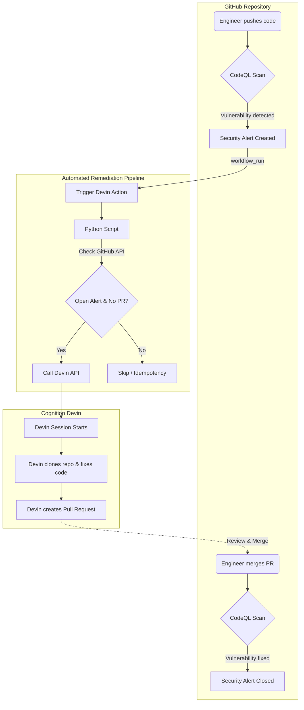

# Overview

> **Note:** This project is a deliverable for **Client C: MedSecure -- "Our security backlog is a compliance risk"**.

This is a Devin sample app project demonstrating an automated security remediation pipeline using GitHub Actions, CodeQL, and the Devin API.

## Automated Remediation Workflow

The following diagram illustrates the end-to-end automated workflow for fixing CodeQL security alerts:

## 🚀 Next Steps (Production Rollout)

To turn this automation into a perfect operational foundation for production environments, the following enhancements are proposed:

1. **Automated Reviewer Assignment (`git blame`)**
   - Automatically identify the original author of the vulnerable code using `git blame`.
   - Dynamically assign the identified developer as a mandatory reviewer on the Pull Request generated by Devin, ensuring accountability and faster reviews.

2. **Real-time Slack Notifications**
   - Integrate Slack webhooks into the pipeline.
   - Send real-time alerts to the security and engineering channels when a vulnerability is detected and when Devin successfully creates a remediation PR, keeping all stakeholders in the loop without manual tracking.